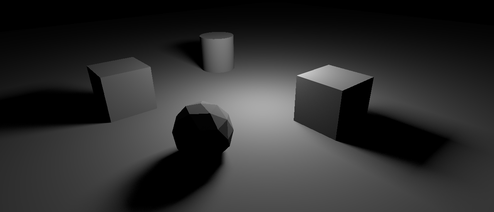
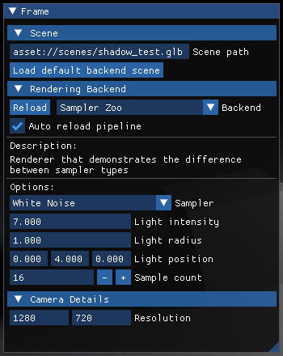

# Vulkan KHR Raytracer

A simple raytracer built using Vulkan and the cross-vendor raytracing extension. 

## Cloning
This project uses some submodules, so make sure to add the `--recursive` flag to the clone command:

	git clone --recursive https://github.com/p2jason/vulkan-khr-raytracer

## Building
This project uses CMake as its build system, so you just need to follow the typical CMake steps:

	mkdir build
	cd build
	cmake ..
	cmake --build . --config Release

## Running
You do not need to have the Vulkan SDK installed. As long as you have a raytracing-capable graphics card, you should be able to run the project.

The renderer includes a simple user interface that you can use to control certain graphics settings. It allows you to switch between different scenes, rendering backends, and change camera settings.

By default, the location and orientation of the camera will be taken from the current scene, however, you can move the camera around manually, if you want to. Just click on the renderer window and press escape. Then, use WASD and your mouse to move the camera around.
